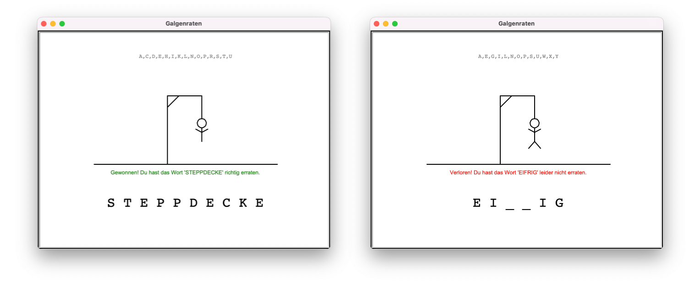

# Hangman (Galgenraten)

A simple game in Python. The goal is to guess a word.

There is a text based and a graphical version.

> [!WARNING]
>
> - The code is not yet fully commented.
> - The graphical version is not yet uploaded.

## How to build and run

1. Download the _python/hangman/_ folder to your computer.
2. Go in the _hangman/_ folder with `cd hangman/`.
3. Run it with `python main.py` or `python3 main.py`.
4. Follow the instructions.

## How to play

### The text based version

```txt
Willkommen zu Galgenraten!

Gesucht wird ein Wort mit 5 Buchstaben.

_ _ _ _ _

10/10 Leben
Verwendet:
Welcher Buchstabe ist enthalten? a
> Richtig :)

_ _ A _ _

10/10 Leben
Verwendet: A
Welcher Buchstabe ist enthalten? l
> Falsch, du verlierst ein Leben :(

_ _ A _ _

9/10 Leben
Verwendet: A,L
Welcher Buchstabe ist enthalten?

...
```

### The graphical version


