# Wie erstelle ich ein Fang die Noten Spiel

<!--toc:start-->

- [Anleitung](#anleitung)
  - [Einleitung](#einleitung)
  - [Vorbereitung](#vorbereitung)
  - [Erstellen des Spiels](#erstellen-des-spiels)
    - [Erstellen des Studenten](#erstellen-des-studenten)
    - [Erstellen des Laptops](#erstellen-des-laptops)
    - [Erstellen der Noten](#erstellen-der-noten)
    - [Die Spielmechanik](#die-spielmechanik)
      - [Benötigte Variablen](#benötigte-variablen)
      - [Anpassung der Figur "Student"](#anpassung-der-figur-student)
      - [Anpassung der Figur "Laptop"](#anpassung-der-figur-laptop)
      - [Anpassung der Figur "Note"](#anpassung-der-figur-note)
      - [Hinzufügen der Figur "Ende"](#hinzufügen-der-figur-ende)
  - [Die finalen Scripte](#die-finalen-scripte)
    - [Student](#student)
    - [Laptop](#laptop)
    - [Note](#note)
    - [Ende](#ende)
    <!--toc:end-->

## Einleitung

Dies ist eine Schritt-für-Schritt-Anleitung für die Erstellung des "Catch
Grades" Spiels in [Scratch](https://scratch.mit.edu/).

## Vorbereitung

1. Öffne den [Scratch Editor](https://scratch.mit.edu/projects/editor/) in
   deinem Browser um ein neues Projekt zu erstellen. Wenn du bereits ein Projekt
   geöffnet hast, kannst du im Menü "Datei" und "Neu" wählen, um ein neues
   Projekt zu erstellen.

   

2. Entferne die vorhandene Katze Figur aus dem Projekt. Klicke hierzu auf das
   Papierkorb-Symbol auf der Katze.

   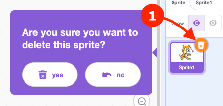

## Erstellen des Spiels

### Erstellen des Studenten

1. Erstelle eine neue Figur. Klicke hierzu auf "Figur wählen" und wähle "Abby".

   - Setze folgende Eigenschaften:

     | Eigenschaft | Wert    |
     | ----------- | ------- |
     | Figur       | Student |
     | x           | 200     |
     | y           | 0       |
     | Größe       | 35      |

   - Wähle im Reiter "Kostüme" jedes Kostüm aus und spiegel es horizontal, so
     dass die Figur nach links schaut.

   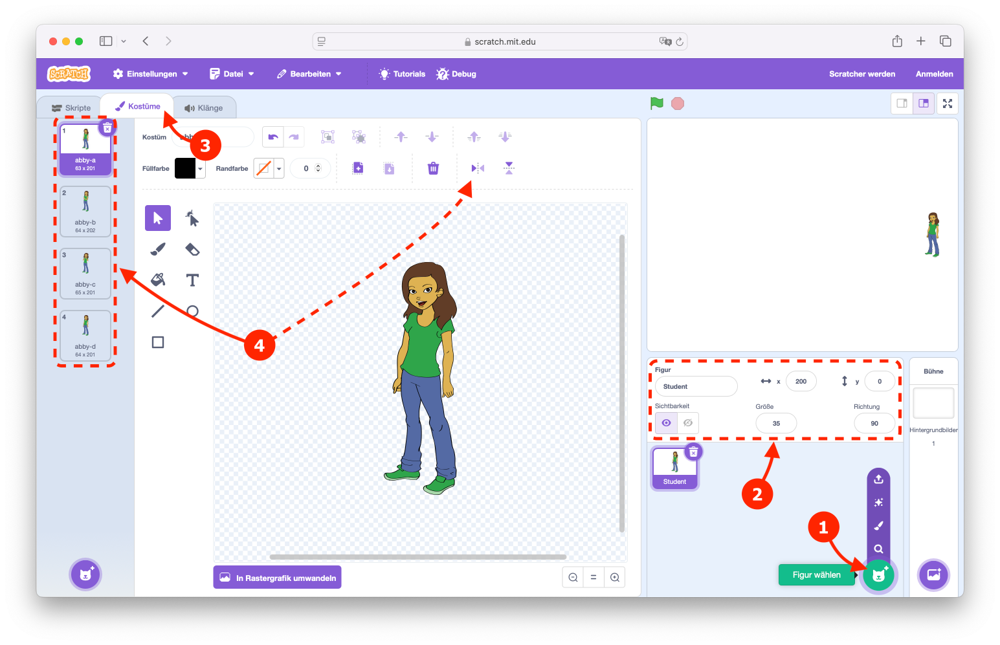

2. Für die Bewegung nach oben und unten, füge im Reiter "Scripte" folgende
   Blöcke hinzu:

   | Kategorie  | Block                                |
   | ---------- | ------------------------------------ |
   | Bewegung   | "gehe zu x: (200) y: (0)"            |
   | Steuerung  | "wiederhole fortlaufend"             |
   | Steuerung  | "falls < >, dann"                    |
   | Fühlen     | "Taste (Pfeil nach oben) gedrückt?"  |
   | Bewegung   | "gehe zu x: (200) y: (0)"            |
   | Operatoren | "( ) + (10)"                         |
   | Bewegung   | "y-position"                         |
   | Fühlen     | "Taste (Pfeil nach unten) gedrückt?" |
   | Bewegung   | "gehe zu x: (200) y: (0)"            |
   | Operatoren | "( ) - (10)"                         |
   | Bewegung   | "y-position"                         |

   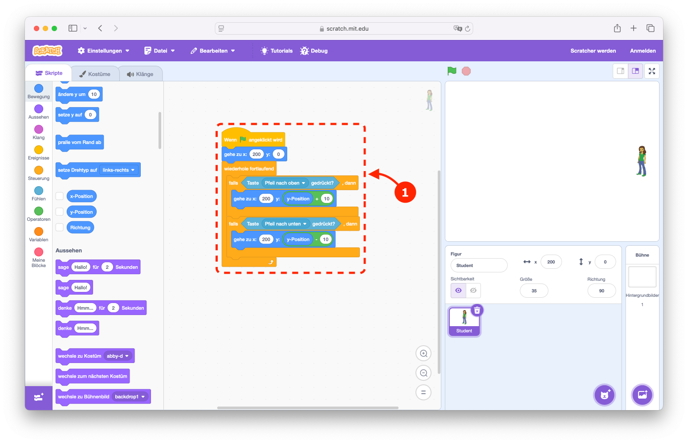

> [!NOTE]
>
> Mit dem Betätigen der grünen Flagge wird das Spiel gestartet. Die Figur
> "Student" lässt sich jetzt mit den Pfeiltasten nach oben und unten bewegen.

### Erstellen des Laptops

1. Erstelle eine neue Figur. Klicke hierzu auf "Figur wählen" und wähle
   "Laptop".

   | Eigenschaft | Wert   |
   | ----------- | ------ |
   | Figur       | Laptop |
   | x           | -180   |
   | y           | -130   |
   | Größe       | 50     |

   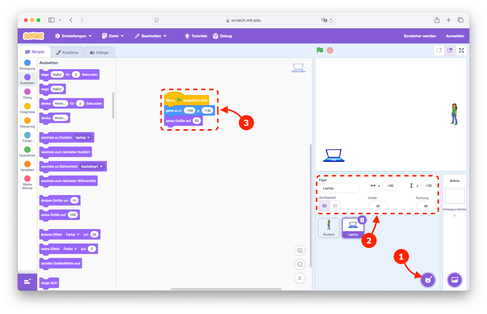

> [!NOTE]
>
> Im Spiel taucht jetzt zusätzlich ein Laptop links unten auf.

### Erstellen der Noten

1. Erstelle eine neue Figur für die Note 1. Klicke hierzu auf "Figur wählen" und
   wähle "Glow-1".

   | Eigenschaft  | Wert        |
   | ------------ | ----------- |
   | Figur        | Note        |
   | Sichtbarkeit | Hide sprite |

   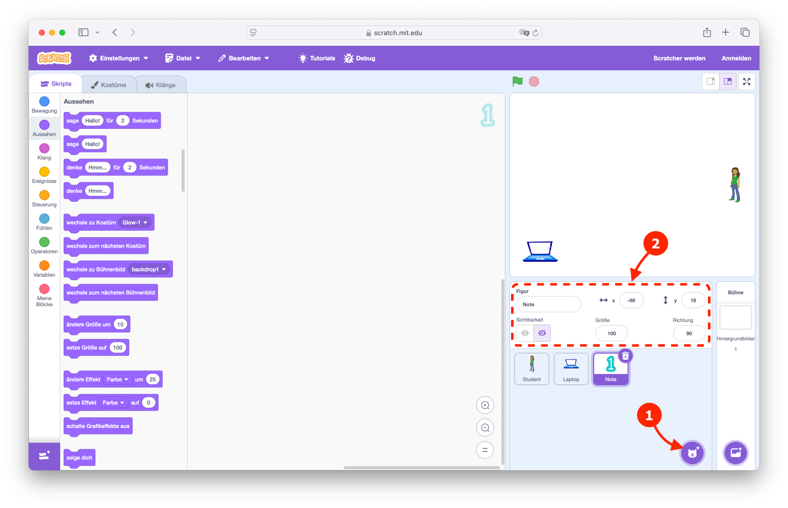

2. Erstelle im Reiter "Kostüme" weitere Kostüme für die Noten 2 bis 6.

   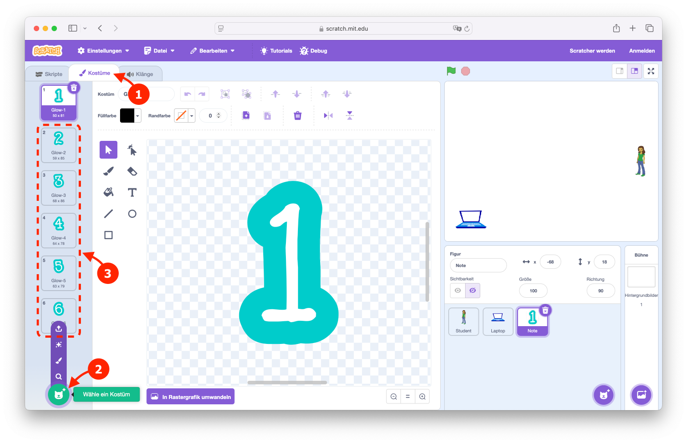

3. Ändere für die Noten 5 und 6 die Farbe auf rot.

   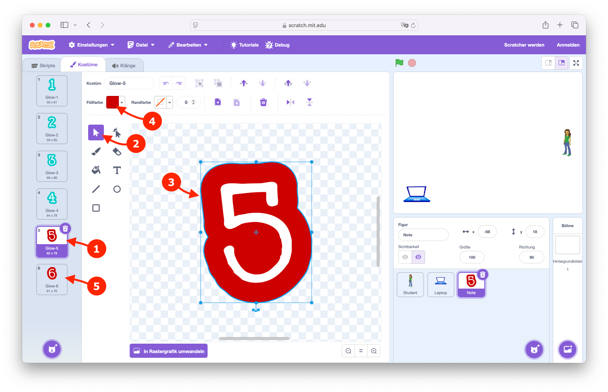

4. Für die zufällige Auswahl und Bewegung einer Note, füge im Reiter "Scripte"
   folgende Blöcke hinzu:

   | Kategorie  | Block                                                                             |
   | ---------- | --------------------------------------------------------------------------------- |
   | Steuerung  | "wenn ich als Klon entstehe"                                                      |
   | Variablen  | Neue Variable: "Lokale Note", "Nur für diese Figur" (siehe nachfolgender Hinweis) |
   | Variablen  | "setze [Lokale Note] auf (0)"                                                     |
   | Operatoren | "Zufallszahl von (1) bis (6)"                                                     |
   | Aussehen   | "wechlse zu Kostüm (...)"                                                         |
   | Variablen  | "Lokale Note"                                                                     |
   | Aussehen   | "setze Größe auf (20)"                                                            |
   | Bewegung   | "gehe zu (Laptop)"                                                                |
   | Aussehen   | "zeige dich"                                                                      |
   | Bewegung   | "gleite in ( ) Sek. zu x: (240) y: ( )"                                           |
   | Operatoren | "Zufallszahl von (2) bis (4)"                                                     |
   | Operatoren | "Zufallszahl von (-160) bis (160)"                                                |
   | Steuerung  | "lösche diesen Klon"                                                              |

   > **Hinweis**: Beim Anlegen der Variable "Lokale Note" muss die Option "Nur
   > für diese Figur" ausgewählt werden. Damit hat jede Instanz der Figure
   > "Note" ihre eigene Variable für die Note die sie repräsentiert.
   >
   > 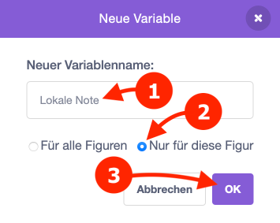

   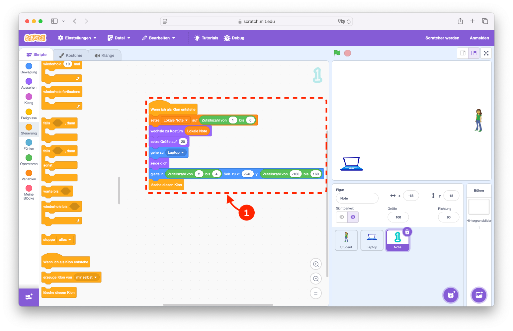

5. Damit sich die Note in der Bewegung vergrößert, füge im Reiter "Scripte"
   folgende Blöcke hinzu:

   | Kategorie | Block                        |
   | --------- | ---------------------------- |
   | Steuerung | "wenn ich als Klon entstehe" |
   | Steuerung | "wiederhole fortlaufend"     |
   | Steuerung | "warte (0.1) Sekunden"       |
   | Aussehen  | "ändere Größe um (2)"        |

   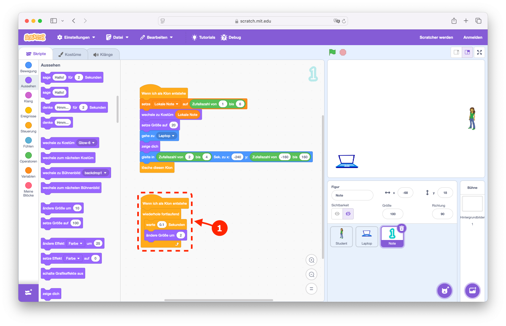

6. Damit erkannt wird, wann eine Note den Studenten berührt, füge im Reiter
   "Scripte" folgende Blöcke hinzu:

   | Kategorie | Block                           |
   | --------- | ------------------------------- |
   | Steuerung | "wenn ich als Klon entstehe"    |
   | Steuerung | "wiederhole fortlaufend"        |
   | Steuerung | "falls < >, dann"               |
   | Fühlen    | "wird (Student) berührt?, dann" |
   | Steuerung | "lösche diesen Klon"            |

   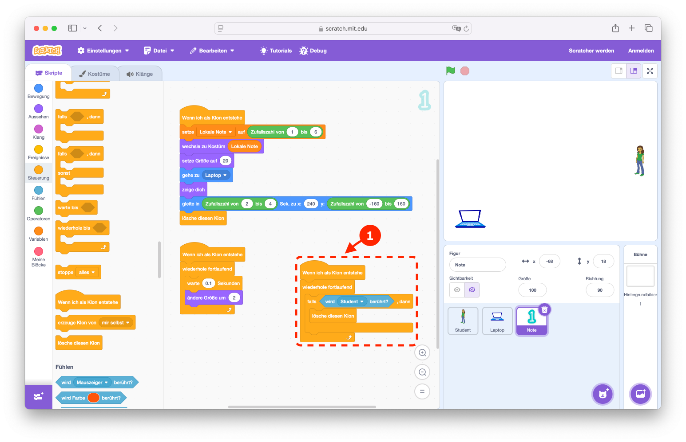

7. Erstelle im Reiter "Scripte" der Figur "Laptop" folgende Blöcke, um die Noten
   fortlaufend fliegen zu lassen:

   | Kategorie | Block                     |
   | --------- | ------------------------- |
   | Steuerung | "wiederhole fortlaufend"  |
   | Steuerung | "erzeuge Klon von [Note]" |
   | Steuerung | "warte (1) Sekunden"      |

   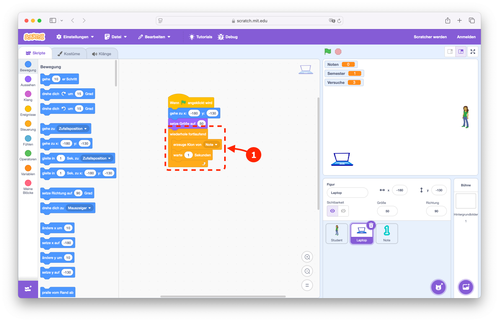

> [!NOTE]
>
> Mit dem Starten des Spiels fliegen jetzt zufällige Noten (1-6) vom Laptop nach
> rechts durch das Bild. Werden sie vom Studenten gefangen, verschwinden sie.

### Die Spielmechanik

#### Benötigte Variablen

1. Erstelle die Variablen: "Noten", "Semester", "Versuche" und "Ende"
   (ausgeblendet) und füge im Reiter "Scripte" der Figur "Student" folgende
   Blöcke hinzu:

   | Kategorie | Block                      |
   | --------- | -------------------------- |
   | Variablen | "setze [Noten] auf (0)"    |
   | Variablen | "setze [Semester] auf (1)" |
   | Variablen | "setze [Versuche] auf (3)" |
   | Variablen | "setze [Ende] auf (0)"     |

   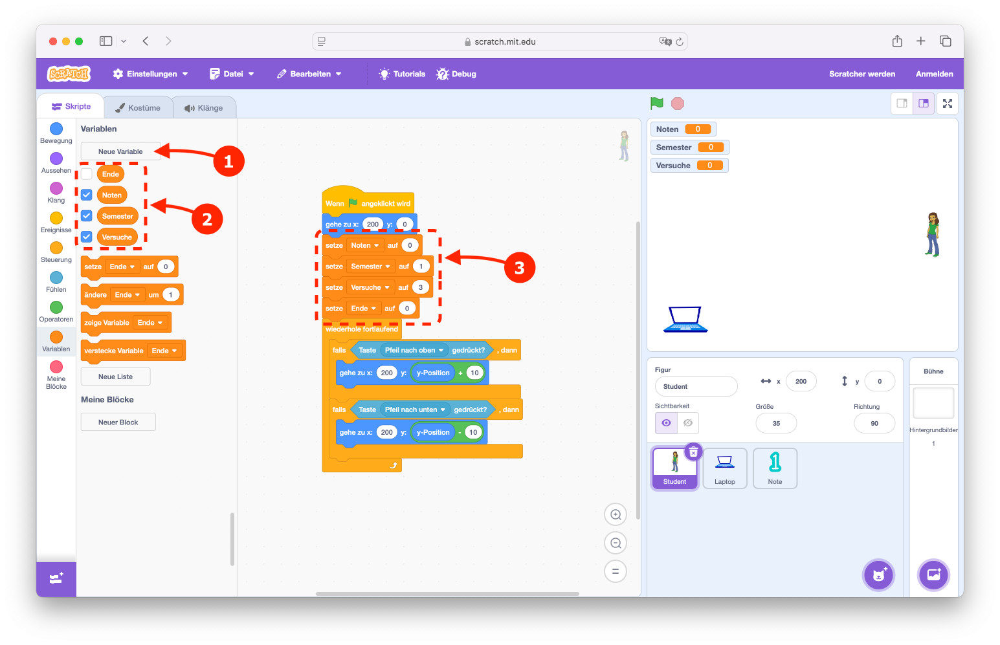

#### Anpassung der Figur "Student"

1. Erstelle im Reiter "Scripte" der Figur "Student" folgende Blöcke für die
   Nachricht "Note erhalten":

   | Kategorie  | Block                                                                                    |
   | ---------- | ---------------------------------------------------------------------------------------- |
   | Ereignisse | "Wenn ich [Note erhalten] empfange" mit neuer Nachricht "Note erhalten"                  |
   | Aussehen   | "wechsle zu Kostüm (abby-c)"                                                             |
   | Variablen  | "ändere [Noten] um (1)"                                                                  |
   | Variablen  | "setze [Semester] auf ( )"                                                               |
   | Operatoren | "[aufrunden] von ( )" (zu finden als "[Betrag] von ( )", "Betrag" in "aufrunden" ändern) |
   | Operatoren | " ( ) / (5)"                                                                             |
   | Variablen  | "Noten"                                                                                  |
   | Steuerung  | "falls < >, dann"                                                                        |
   | Operatoren | "( ) = (30)"                                                                             |
   | Variablen  | "Noten"                                                                                  |
   | Ereignisse | "sende (Spiel beendet) an alle" mit neuer Nachricht "Spiel beendet"                      |
   | Steuerung  | "warte (0.5) Sekunden"                                                                   |
   | Aussehen   | "wechsle zu Kostüm (abby-a)"                                                             |

   Füge im Block "Wenn grüne Flagge angeklickt wird" als erstes folgenden Block
   hinzu:

   | Kategorie | Block                        |
   | --------- | ---------------------------- |
   | Aussehen  | "wechsle zu Kostüm (abby-a)" |

   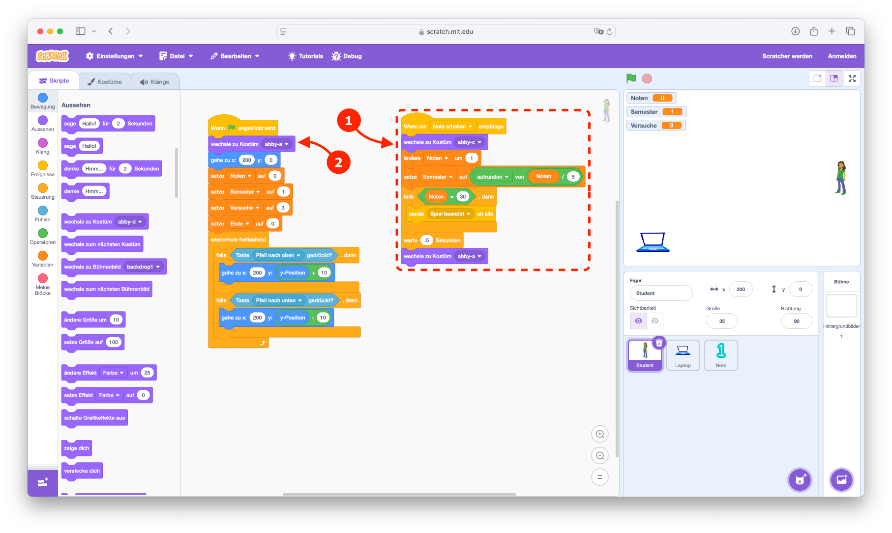

2. Erstelle im Reiter "Scripte" der Figur "Student" folgende Blöcke für die
   Nachricht "Spiel beendet":

   | Kategorie  | Block                                  |
   | ---------- | -------------------------------------- |
   | Ereignisse | "Wenn ich [Spiel beendet] empfange"    |
   | Variablen  | "setze [Ende] auf (1)"                 |
   | Bewegung   |  "gleite in (1) Sek. zu x: (0) y: (0)" |

   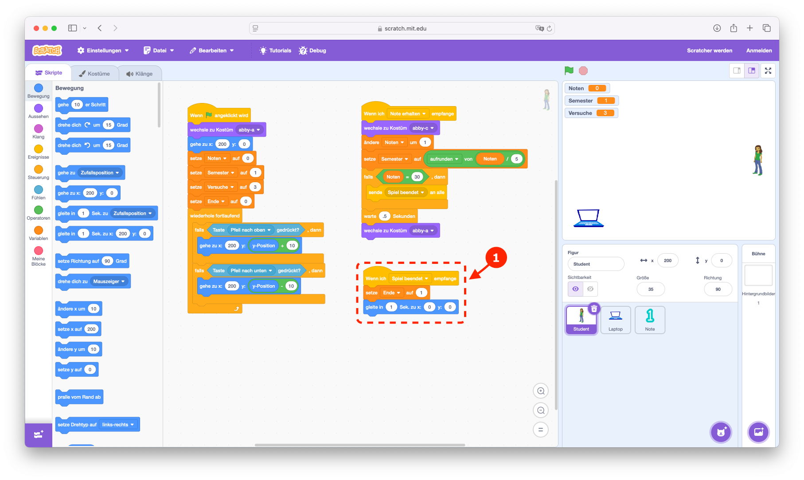

> [!NOTE]
>
> Bei jeder Nachricht "Note erhalten" verändert die Figur "Student" kurz ihr
> aussehen und die Anzahl der Noten wird um eins erhöht. Wenn der Student 30
> Noten erhalten (gefangen) hat und somit 6 Semester erreicht hat, wird das
> Spiel beendet und der Student bewegt sich in die Mitte.
>
> Dies funktioniert erst nach Anpassung der Figure "Note" im übernächsten
> Schritt.

#### Anpassung der Figur "Laptop"

1. Füge im Reiter "Scripte" der Figur "Laptop" im Block "wiederhole fortlaufend"
   folgende Blöcke hinzu:

   | Kategorie  | Block             |
   | ---------- | ----------------- |
   | Steuerung  | "falls < >, dann" |
   | Operatoren | "( ) = (0)"       |
   | Variablen  | "Ende"            |

   Schiebe die beiden vorhandenen Blöcke in den neuen Block "falls < >, dann"
   ein.

   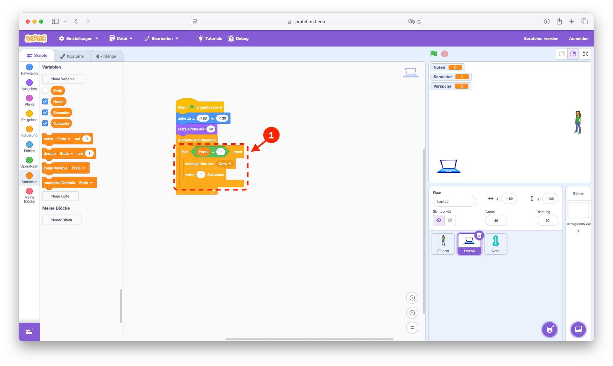

> [!NOTE]
>
> Es werden jetzt nur solange neue Noten erzeugt, wie die Variable "Ende" noch
> den Wert `0` hat.

#### Anpassung der Figur "Note"

1. Füge im Reiter "Scripte" der Figur "Note" im Block, in dem überprüft wird, ob
   der Student berührt wird, folgende Blöcke hinzu:

   | Kategorie  | Block                           |
   | ---------- | ------------------------------- |
   | Steuerung  | "falls < >, dann ... sonst"     |
   | Operatoren | "( ) < (5)"                     |
   | Variablen  | "Lokale Note"                   |
   | Ereignisse | "sende (Note erhalten) an alle" |
   | Variablen  | "ändere [Versuche] um (-1)"     |
   | Steuerung  | "falls < >, dann"               |
   | Operatoren | "( ) < (0)"                     |
   | Variablen  | "Versuche"                      |
   | Ereignisse | "sende (Spiel beendet) an alle" |

   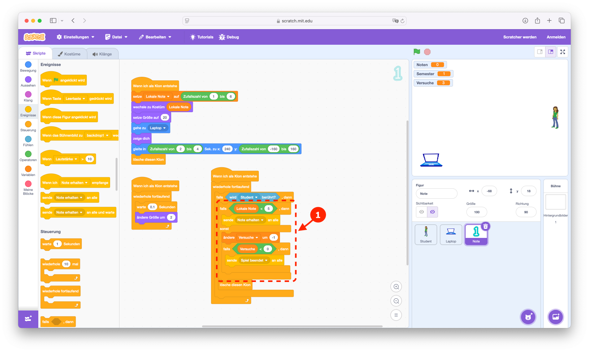

2. Für das entfernen aller noch fliegenden Noten am Spielende, füge im Reiter
   "Scripte" der Figur "Note" folgende Blöcke hinzu:

   | Kategorie  | Block                               |
   | ---------- | ----------------------------------- |
   | Ereignisse | "Wenn ich [Spiel beendet] empfange" |
   | Control    | "lösche diesen Klon"                |

   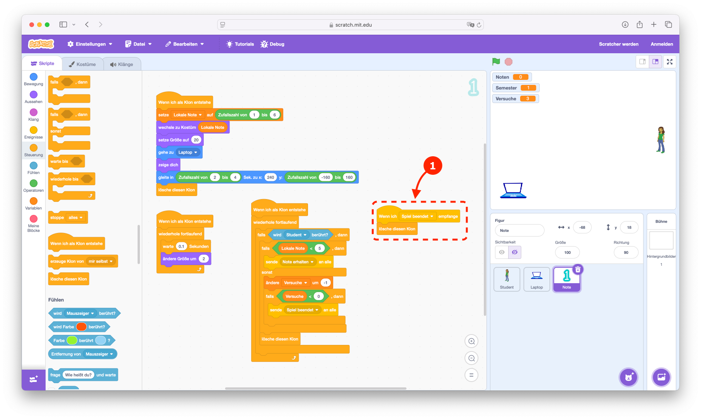

> [!NOTE]
>
> Gefangene Noten von 1 bis 4 erhöhen die Notenanzahl um 1 und gefangene Noten
> von 5 bis 6 verringern die Anzahl der Versuche um 1. Das Spiel endet, wenn die
> Anzahl der Versuche kleiner 0 erreicht hat oder 30 Noten gesammelt worden.

#### Hinzufügen der Figur "Ende"

1. Erstelle eine neue Figur. Klicke hierzu auf "Figur wählen" und wähle
   "Button4".

   - Setze folgende Eigenschaften:

     | Eigenschaft  | Wert        |
     | ------------ | ----------- |
     | Figur        | Ende        |
     | Sichtbarkeit | Hide sprite |

   - Nenne das Kostüm "button5-a" in "Gut" um.
   - Lösche das Kostüm "Button4-b".
   - Erstelle im Reiter "Kostüme" über den Button "Wähle ein Kostüm" ein neues
     Kostüm "Button5-b".
   - Nenne das Kostüm "Button5-b" in "Schlecht" um.

   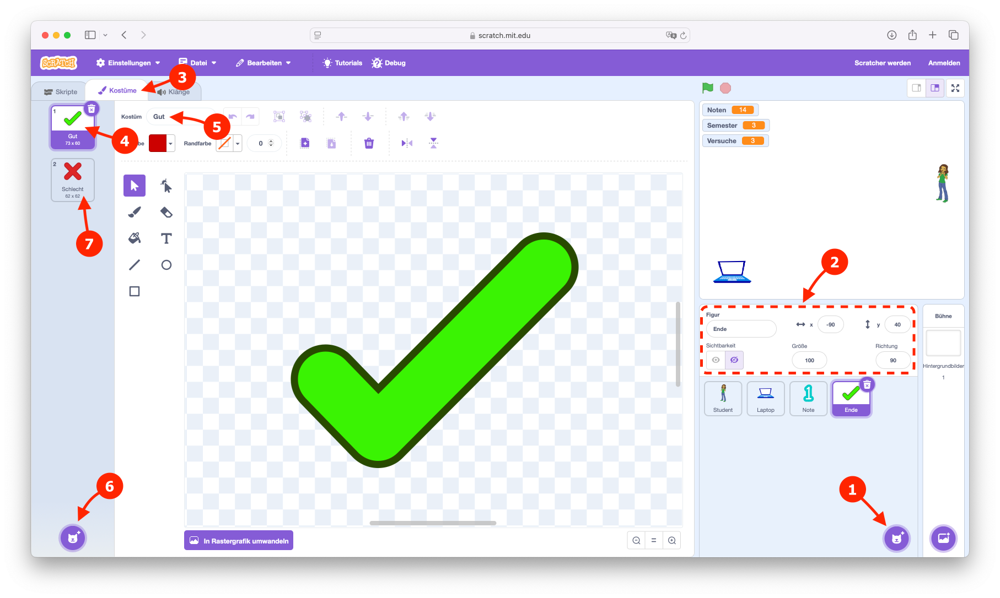

2. Füge im Reiter "Scripte" der Figur "Ende" folgende Blöcke hinzu:

   | Kategorie  | Block                               |
   | ---------- | ----------------------------------- |
   | Ereignisse | "Wenn grüne Flagge angeklickt wird" |
   | Aussehen   | "verstecke dich"                    |

   | Kategorie  | Block                             |
   | ---------- | --------------------------------- |
   | Steuerung  | "Wenn ich als Klon entstehe"      |
   | Steuerung  | "falls < >, dann ... sonst"       |
   | Operatoren | "( ) = (30)"                      |
   | Variablen  | "Noten"                           |
   | Aussehen   | "wechsle zu Kostüm (Gut)"         |
   | Aussehen   | "wechsle zu Kostüm (Schlecht)"    |
   | Bewegung   | "gehe zu (Laptop)"                |
   | Aussehen   | "setze Größe auf (50)"            |
   | Aussehen   | "zeige dich"                      |
   | Bewegung   | "gleite in (1) Sek. zu (Student)" |

   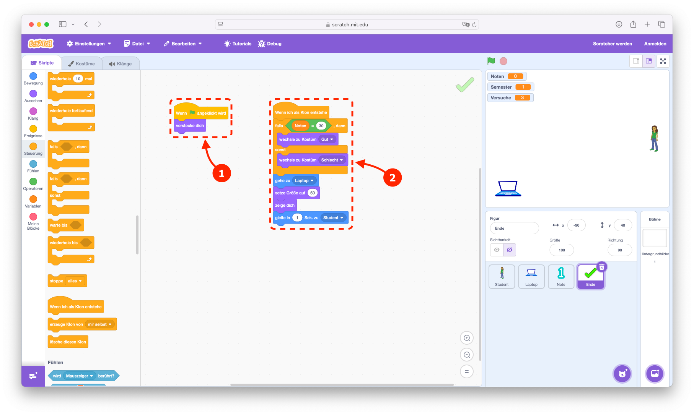

3. Füge im Reiter "Scripte" der Figur "Student" folgenden Block hinzu:

   | Kategorie | Block                     |
   | --------- | ------------------------- |
   | Steuerung | "erzeuge Klon von [Ende]" |

   

> [!NOTE]
>
> Das Spiel zeigt jetzt ein gutes und ein schlechtes Ende an.

## Die finalen Scripte

### Student

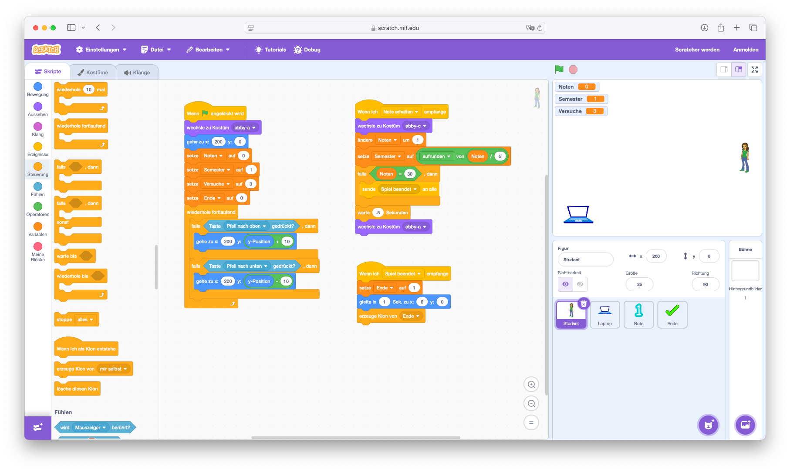

### Laptop

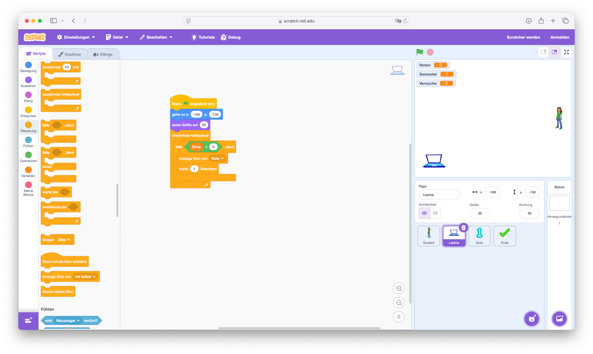

### Note

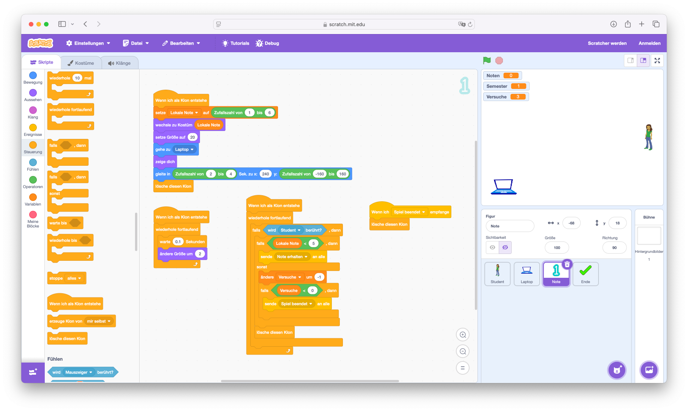

### Ende

